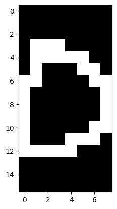
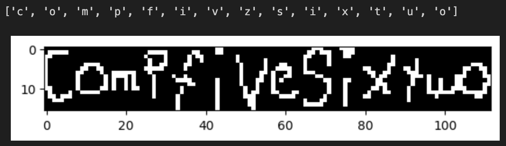
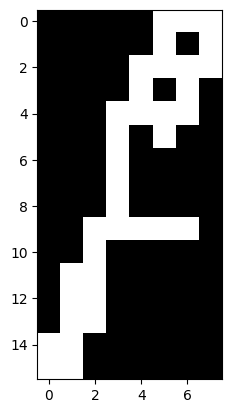

# COMP 562 Final Project

I chose to create an Optical Character Recognition model using Ridge-regularized logistic regression.

## Dataset
I thought this would be a good fit for an OCR model given that we won't be dealing with sparse data. I was able to find a dataset [here]("https://ai.stanford.edu/%7Ebtaskar/ocr/") that gave a list of 8x16 binary images that encoded letters.

the letter `o`

## Cross Validation
The data is already split into folds, so this was a perfect setup for k-fold cross-validation. From my testing, I found that a high initial-step of $\frac{1}{10000}$, a relatively low iteration count of 200, and a ridge penalty value of 50 worked well. Over the 10-fold cross validation I performed, I got a CVError of 0.273, or 27.3%. 

## Design
The dataset is designed with 26 classes (one for each letter of the alphabet), and 128 features (binary pixel values). For training, we tune the weights for our likelihood using gradient ascent. I used one-hot encoding for the letters, so we have 26 sets of weights to compute the likelihood that a given image is a given letter. For example, if the image is of the letter `a`, then we would expect the first probability $p_0$ to be the highest. If the image is of the letter `z`, then we would expect the last probability $p_{25}$ to be the highest. This calculation is done in the `predict` and `validate` functions.

## Testing
As a demo, I made a quick java program that allows you to draw your own 8x16 letter, and turn it into an array you can paste into the python notebook. I used it to write out "comp five six two" to test my classifier.

We can see that some letters were misclassified, like the `e` turning into a `z` and the `w` turning into a `u`.

## Possible improvements
I believe, given more time, I could create a better model with my current method and better hyperparameters. The issue with increasing the number of iterations, though, is that it could lead to overfitting. 
Similarly, the dataset I am using is not very large and has some weirdly written letters. For example, the letter f:

I experimented with the [emnist-letters dataset](https://www.kaggle.com/datasets/crawford/emnist?resource=download&select=emnist-letters-test.csv), but found that I was not able to get a good result in any reasonable amount of time. So, I stuck with my quirky dataset.

An interesting extension of this project could be to use Principle Component Analysis to analyize the user's handwriting, and create a pdf from plain-text that looks hand-written.
For example, we could get the principle components of a `w` from training dataset, get the average handwritten `w` of the user from a picture, and then use slight variations of it as a font.
